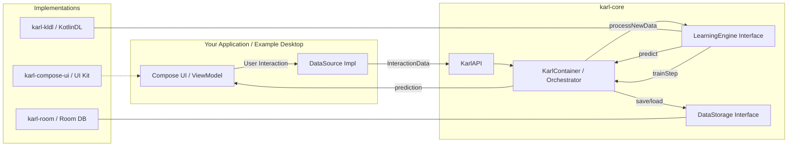
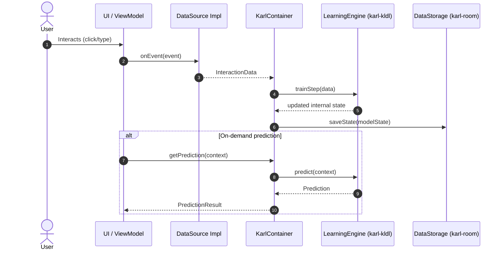
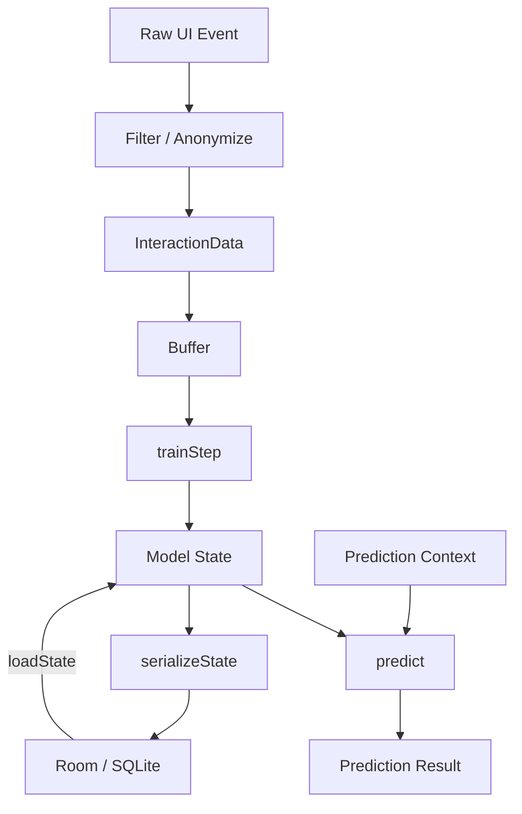
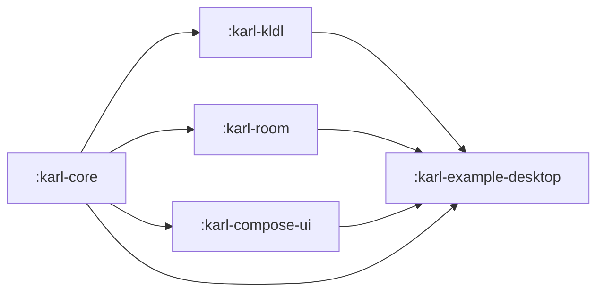

# System Architecture

This document provides a multi‑view representation of the Project KARL architecture, showing how application UI events flow through the KARL Core orchestration layer into pluggable learning and storage components, and back as adaptive predictions.

## High‑Level Component View



### Responsibilities

| Layer | Responsibility | Notes |
|-------|----------------|-------|
| Application UI | Captures raw events, displays predictions | Framework agnostic except example uses Compose |
| DataSource Impl | Filters & transforms raw UI events into `InteractionData` | Enforces privacy constraints |
| Karl Core (Container) | Orchestrates training, prediction, state persistence | Stateless API + stateful container |
| LearningEngine Impl | Performs incremental training & inference | Pluggable ML engines (KotlinDL now) |
| DataStorage Impl | Persists container + model state locally | Room/SQLite; future: encrypted backends |
| Compose UI Kit | Optional prebuilt visualization components | Not required for headless usage |

## Sequence: Event → Prediction Loop



## Data Model Flow



## Module Dependency (Logical)



## Lifecycle Summary

1. Application instantiates `KarlContainer` via `KarlAPI.forUser(userId).build()`.
2. UI events converted into sanitized `InteractionData` by DataSource implementation.
3. Container streams each data point into `LearningEngine.trainStep()` (incremental learning).
4. Updated model state persisted asynchronously (or at checkpoints) via `DataStorage`.
5. Prediction requests call `predict()`; results returned to UI for adaptive behavior.
6. On app start, previous state is loaded from storage to warm model quickly.

## Extensibility Points

| Interface | Purpose | Replace With |
|-----------|---------|--------------|
| LearningEngine | Algorithm & model backend | Alternative ML (ONNX, TFLite custom) |
| DataStorage | State persistence | Encrypted DB, file-based, in-memory |
| DataSource | Domain event translation | Different app domains (IDE, productivity) |
| InstructionParser | Runtime rule adaptation | DSL or policy engines |

## Non-Functional Considerations

| Aspect | Strategy |
|--------|----------|
| Privacy | Raw events filtered & anonymized before leaving UI layer |
| Performance | Incremental training keeps latency low; batching optional |
| Resilience | State persisted after configurable intervals / graceful shutdown hooks |
| Portability | Core is KMP (currently JVM target) enabling future platform expansion |
| Observability | Optional hooks/StateFlows can expose metrics & model summaries |

## Future Enhancements (Roadmap Snippets)

- Add encryption layer around `DataStorage`.
- Pluggable scheduler for background training bursts.
- Multiple concurrent containers per user context (projects, workspaces).
- Federated offline aggregation (opt-in) without raw data sharing.

## Original ASCII Diagram (Legacy Reference)

```pgsql
-----------------------------------------------------------------------------------
|                                                                                 |
|   YOUR APPLICATION (e.g., :karl-example-desktop)                                |
|   (Manages UI, User Events, and CoroutineScope)                                 |
|                                                                                 |
|   +-------------------------------------------------------------------------+   |
|   |                                                                         |   |
|   |   UI Layer (Jetpack Compose)                                            |   |
|   |                                                                         |   |
|   |   [ User Clicks Button ] ----> [ ViewModel / State Holder ]             |   |
|   |                                                                         |   |
|   +--------------------------------|----------------------------------------+   |
|                                    |                                            |
-------------------------------------|---------------------------------------------
                                                                                  |
                       (1. User Action Captured)
                                                                                  |
-------------------------------------|---------------------------------------------
|                                    |                                            |
|   :karl-core (KMP)                 |  [ DataSource Impl ]                       |
|   (Defines Contracts & Models)     |  (Implements :karl-core's DataSource)      |
|                                    |                                            |
|   +--------------------------------V----------------------------------------+   |
|   |                                                                         |   |
|   |   KarlAPI.forUser("...").build() ---> [ KarlContainer Instance ]        |   |
|   |   (Orchestrator)                                                        |   |
|   |                                                                         |   |
|   |                   (2. processNewData())                                 |   |
|   |      |                                                                  |   |
|   |      +----------------------------------------------------------------- |   |
|   |      |                                                                  |   |
|   |      |            (3. trainStep(InteractionData))                       |   |
|   |      V                                                                  |   |
|   |      +----------------------------------------------------------------- |   |
|   |                                                                         |   |
|   |                   [ LearningEngine Interface ]                          |   |
|   |                                                                         |   |
|   |      +----------------------------------------------------------------- |   |
|   |                   (4. getPrediction())                                  |   |
|   |      +----------------------------------------------------------------- |   |
|   |      ^                                                                  |   |
|   |      |            (5. predict(...))                                     |   |
|   |      |                                                                  |   |
|   |      +----------------------------------------------------------------- |   |
|   |      |                                                                  |   |
|   |      |            (6. saveState() / loadState())                        |   |
|   |      V                                                                  |   |
|   |                   [ DataStorage Interface ]                             |   |
|   |                                                                         |   |
|   +-------------------------------------------------------------------------+   |
|                                                                                 |
-----------------------------------------------------------------------------------
|                        |                      |                        |
| (Implementation)       | (Implementation)     | (Implementation)       | (Implementation)
V                        V                      V                        V
+------------------+     +----------------+     +------------------+     +----------------+
|                  |     |                |     |                  |     |                |
| :karl-kldl       |     | :karl-room     |     | :karl-compose-ui |     | (Your App's    |
| (Implements      |     | (Implements    |     | (Provides UI     |     |  DataSource)   |
|  LearningEngine) |     |  DataStorage)  |     |  Components)     |     |                |
|                  |     |                |     |                  |     |                |
| +------------+   |     | +------------+ |     | +------------+   |     | +------------+ |
| | KotlinDL   |   |     | | Room DB    | |     | | Karl       |   |     | | App Event  | |
| | Model      |   |     | | (SQLite)   | |     | | ContainerUI|   |     | | Listener   | |
| +------------+   |     | +------------+ |     | +------------+   |     | +------------+ |
|                  |     |                |     |                  |     |                |
-------------------+     +----------------+     +------------------+     +----------------+
```
